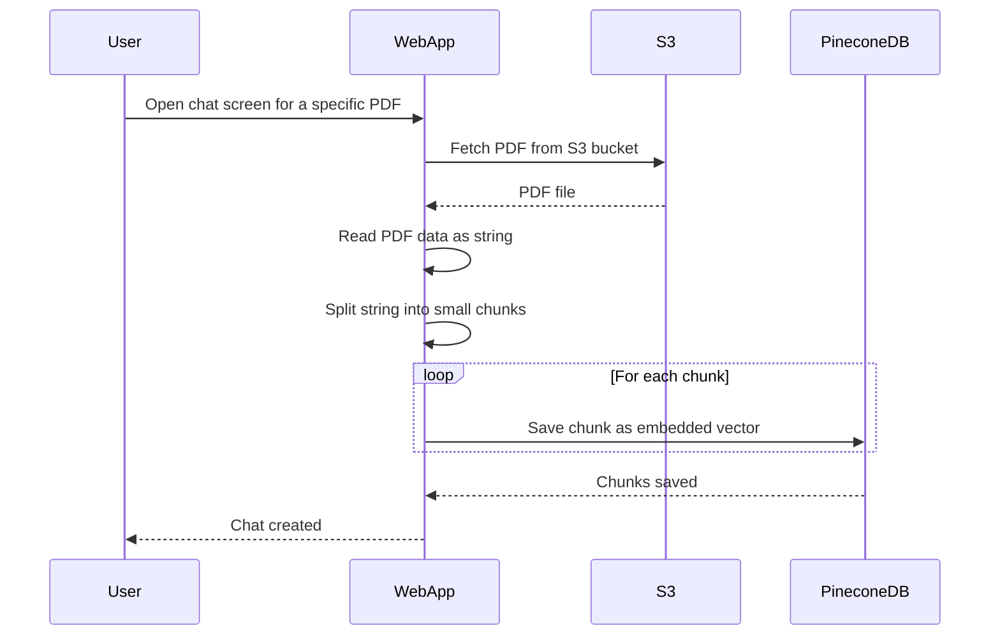

# PDFYAI

## Description of the application

PDFy AI is an application designed to revolutionize how users interact with their PDF documents.
ALl you will need to do is to upload your pdf document then you can start chat with it.

## Tech Stack

- Angualr
- Dotnet core web api
- Amzon S3
- OpenAi
- Paypal
- Google auth

## How chat is created ?

